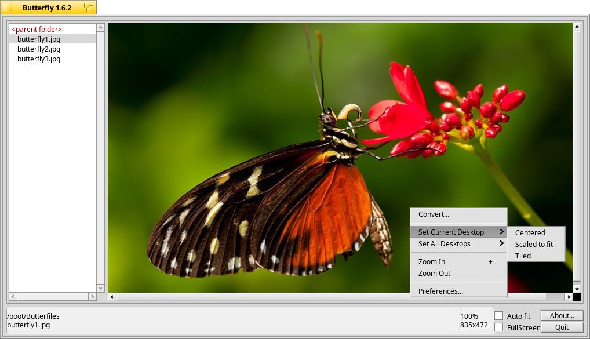

#   Butterfly

Author: Thomas THERY <dragfly_kj@rocketmail.com>

Butterfly is a picture browser based on the translators for displaying bitmap images. It was inspired by Sea, a DOS picture browser. Its aim is to allow easy and fast browsing of a large number of pictures.

 

## DISCLAIMER

This program is provided as is. I take no responsibility for any damage or consequences directly or indirectly, intentionally or unintentionally, which may arise from using this program - YOU USE IT AT YOUR OWN RISK!

## Features

- File system browsing.
- Drag-and-drop support (resolving symbolic links).
- Dynamically resize bitmaps to fit in the window.
- Zoom-In and Zoom-Out.
- Convert and Save to others formats.
- Pan using the mouse.
- Mouse wheel support to browse images.
- Backgrounds support.
- Multi-lingual support: English, French, Russian, Brazilian-Portuguese, Italian, Spanish, Euskera, German.

## Usage

You can either use the mouse or the keyboard to browse.

To enter a directory, double click it or press Enter. The current path is displayed in the status bar.

To display an image file, click on its name, use the keyboard arrows or the mouse wheel to highlight it.

Drag'n'Drop is supported in different manners. You can drag an image file's icon on Butterfly's icon to launch it. You can drag an image file's icon or a directory to Butterfly window. 

Right-clicking in the picture view opens a popup menu with different options (see below).

### Commands:
**+/-**         :    Zoom in/out

**\***          :    Reset zoom factor to 100%

**[Space] or .**:    Toggle real fullscreen mode (nothing but the picture)
 
 
**Up Arrow**:        Move up within the file list

**Down Arrow**:      Move down within the file list

**Backspace**:       Go to the parent folder

**Del**:             Delete the selected file
 
 
**Shift + Arrow**:   Move the picture in the given direction
 
 
**Left Mouse Button**:   Pan the picture around

**Right Mouse Button**:  Display the popup menu

### Menu:
**Convert**:            Translate and save the current image to another format

**Set as Desktop**:     Modify the current background image

**Set All Desktops**:   Set all desktop background images

**Zoom-in/out**:        Guess...

**Preferences**:        Open the preferences panel

## Thanks to
Edmund Vermeulen for his translator routines used in the convert feature.
Oleg V. Kourapov for the russian translation.
Leonardo Rota-Rossi from the BeOS User Group Rio de Janeiro for the brasilian-portuguese translation.
Mario Lupi for the italian translation.
Xabier Urrutia for the Euskera/Basque and spanish translations.
Finn Bastiansen for the german translation.

## Feel free to contact us:

CrazyBugs Design
site : http://www.chez.com/bthery/butterfly/Butterfly.html

email: bthery_AT_chez.com (for bug reports) or dragfly_kj_AT_rocketmail.com

Copyright ©1999-2002 CrazyBugs Design. All rights reserved.
