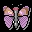

#   Butterfly

    File: Butterfly-v1.6.pkg
    Author: Thomas THERY <dragfly_kj@rocketmail.com>
    Release: v1.6.1 (Nov 2001)
    Compatibility: BeOS R5 for Intel
    Description: Picture browser
    Notes: Freeware

Butterfly is a picture browser based on the translators for displaying bitmap images. It was inspired by Sea, a DOS picture browser. Its aim is to allow easy and fast browsing of an important number of pictures.

 

## DISCLAIMER

This program is provided as is. I take no responsibility for any damage or consequences directly or indirectly, intentionally or unintentionally, which may arise from using this program - YOU USE IT AT YOUR OWN RISK!

## Features

- File system browsing.
- Drag-and-drop support (resolving symbolic links).
- Dynamically resize bitmaps to fit in the window.
- Zoom-In and Zoom-Out.
- Convert and Save to others formats.
- Pan using the mouse.
- Mouse wheel support to browse images.
- Backgrounds support.
- Multi-lingual support: English, French, Russian, Brazilian-Portuguese, Italian, Spanish, Euskera, German.

## Usage

You can either use the mouse or the keyboard to browse.

To enter in a directory, double click it or press Enter. The current path is displayed in the status bar.

To display an image file, click on its name, use the keyboard arrows or the mouse wheel to highlight it.

Drag'n'Drop is supported in different manners. You can drag an image file's icon on Butterfly's icon to launch it. You can drag an image file's icon or a directory to Butterfly window. 

Right-clicking in the picture view opens a popup menu with different options (see below).

### Commands:
**+/-**         :    Zoom in/out

**\***          :    Reset zoom factor to 100%

**[Space] or .**:    Toggle real fullscreen mode (nothing but the picture)
 
 
**Up Arrow**:        Move up within the file list

**Down Arrow**:      Move down within the file list

**Backspace**:       Go to the parent folder

**Del**:             Delete the selected file
 
 
**Shift + Arrow**:   Move the picture in the given direction
 
 
**Left Mouse Button**:   Pan the picture around

**Right Mouse Button**:  Display the popup menu

### Menu:
**Convert**:            Translate and save the current image to another format

**Set as Desktop**:     Modify the current background image

**Set All Desktops**:   Set all desktop background images

**Zoom-in/out**:        Guess...

**Preferences**:        Open the preferences panel

## History

#### Version 1.6.1 ( Nov 2001)
- German translation by Finn Bastiansen.
- Mouse wheel support! Use your mouse wheel to browse the images of the current folder.
#### Version 1.6 ( Oct 2001)
- It is now possible to browse images stored on non-BFS read-only support (cdrom...).
- Swap to fullscreen with tertiary mouse button
- Files passed on the command line or dragged to the application are now properly selected in the list.
- Other minor changes.
#### Version 1.5.1 ( Jan 25th, 2001)
- Brasilian-portuguese translation by Leonardo Rota-Rossi.
- Italian translation by Mario Lupi.
- Spanish and Euskera/Basque translations by Xabier Urrutia.
- A bit more font sensitive .
- The loading window is only shown when the image loading process is a bit long (big images).
- The status bar's color is updated in real-time when modified in the preferences window.
#### Release 1.5 (Dec 6th, 2000)
- Russian translation by Oleg V. Kourapov a.k.a 2sheds.
We would be happy to had new languages to Butterfly, contact us if you speak German, Italian, Spanish, Japanese, Greek... and want a localized version of Butterfly.
- [Backspace] is a new keyboard shortcut to go to the parent folder.
- Drag'n'drop : folders can be dropped on the program's icon.
- Bug fixed : opening the convert panel with no file loaded freezed the application.
- Bug fixed : window's size saved when quitting in real fullscreen mode was invalid.
If you're stuck in fullscreen mode with release 1.4, you can edit the attributes of the file home/config/settings/Butterfly_settings with DiskProbe to solve the problem.
#### Release 1.4 (Nov 24th, 2000)
- Sources modified to support internationalization : french translation available.
- Language can be selected in the preferences window. 
- If anyone wants to see support for other languages please contact us.
- Remember window's size and position, as well as fullscreen and auto-fit modes.
- Removed the blue focus line in the navigation view, plus minor interface fixes.
#### Release 1.3 (Oct 23th, 2000)
- Files can now be deleted from Butterfly. It can be useful if you use it to select/sort large number of images.
- Pressing zoom keys (+/-) while in Auto fit mode, bring you back to normal mode
- Somes fixes.
#### Release 1.2.2 (Oct 3rd, 2000)
- Files and directories are now ordered alphabetically correctly.
- Swapping from fullscreen mode to window mode with Auto fit on now works properly.
- Code improvements.
#### Release 1.2.1 (Sept 24th, 2000)
- Ugly bug corrected : previous version couldn't open directories with more than 128 image files.
#### Release 1.2 (Sept 22nd, 2000)
- Aesthetic changes.
- Better support for drag'n'drop : images can now be dragged on Butterfly icon in the Tracker. 
- Command line argument passing is also supported : Butterfly [image] 
- HTML documentation.
- Use [space] to swap between window mode and full screen mode.
#### Release 1.0b2 (?????????????Oct 24th, 1999)
- Redraw zoom factor when new image loaded.
- Reset zoom to 100%.
#### Release 1.0b1 (Oct 24th, 1999)
- Add 'Set as Desktop image' feature.
- Remove some bugs.
- Add a preference panel.
#### Release 0.9.0 (Oct 16th, 1999)
- Pan using the mouse.
- Convert to other formats.
- Pop-up menu.
#### Release 0.3.0
- Zoom In/Out.
- Keyboard scrolling.
- Drag'n Drop anywhere in the window.
- Vertical scrollbar dimension bug removed.
#### Release 0.2.0 (March 8th, 1999)
- Drag-and-drop support. 
- Enhance display.
#### Release 0.1.0 (March 8th, 1999)
- First public release. 

## Thanks to
Edmund Vermeulen for his translator routines used in the convert feature.
Oleg V. Kourapov for the russian translation.
Leonardo Rota-Rossi from the BeOS User Group Rio de Janeiro for the brasilian-portuguese translation.
Mario Lupi for the italian translation.
Xabier Urrutia for the Euskera/Basque and spanish translations.
Finn Bastiansen for the german translation.

## Feel free to contact us:

CrazyBugs Design
site : http://www.chez.com/bthery/butterfly/Butterfly.html

email: bthery_AT_chez.com (for bug reports) or dragfly_kj_AT_rocketmail.com

Copyright ©1999-2002 CrazyBugs Design. All rights reserved.
